# An interactive historical model of Earth

In this post I will explain how I built an interactive historical model of
earth. Why did I do this? I wanted to make a good way to visualise how geography
played a role in human history. The shifting sea levels and large ice sheets
during the last ice age explain human migration to the americas and
archeological finds under the sea.

The model that I built covers the last 100,000 years and includes elevation,
rising sea levels, changing climate and ice sheets. For this I used multiple
data sources, data processing and THREE.js to render it all.

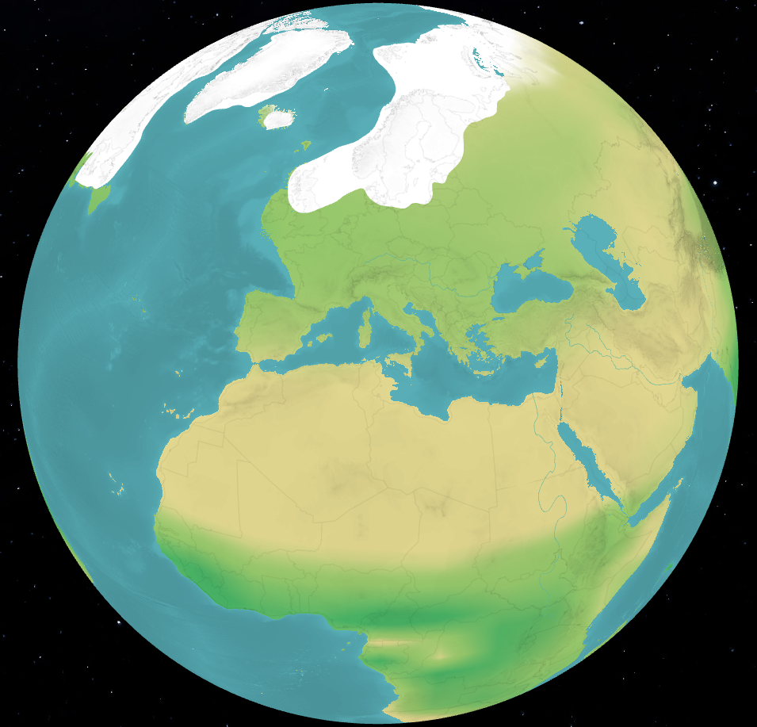

## Elevation map

The most important data that we need is a global elevation map of the earth.
This tells us the height of the terrain with a certain resolution. Each pixel
has a value between -8714 and 5724. Everest is not included because the actual
high point is very small.

We can use the
[ETOPO Global Relief Model](https://www.ncei.noaa.gov/products/etopo-global-relief-model)
from NOAA (National Centers for Environmental Information) for this. It contains
data up to 15 arc-second resolution, much more than we need.

For the my purposes, i only need about 180 arc-second resolution, so I
downloaded the 60 arc-second file and downsampled it used gdalwarp to 0.05
degrees (1 degree = 3600 arc-seconds). This brings it down to around 100MB,
making it much easier to work with.

`gdalwarp -tr 0.05 0.05 -r average ETOPO_2022_v1_60s_N90W180_bed.tif output.tif`

I then loaded this in Node.js using geotiff and wrote a script to compress it
even further. We only need high resolution around the sea level, for determining
the exact water line, so we can make a custom value range for this. We can
compress every height value to a byte (max 256 values), by allocating 25 values
for underwater, 25 for land and the remaining 206 values for the sea level.
Sincesea levels only fluctuated by around 160 meters, this is more than enough
for our purposes.

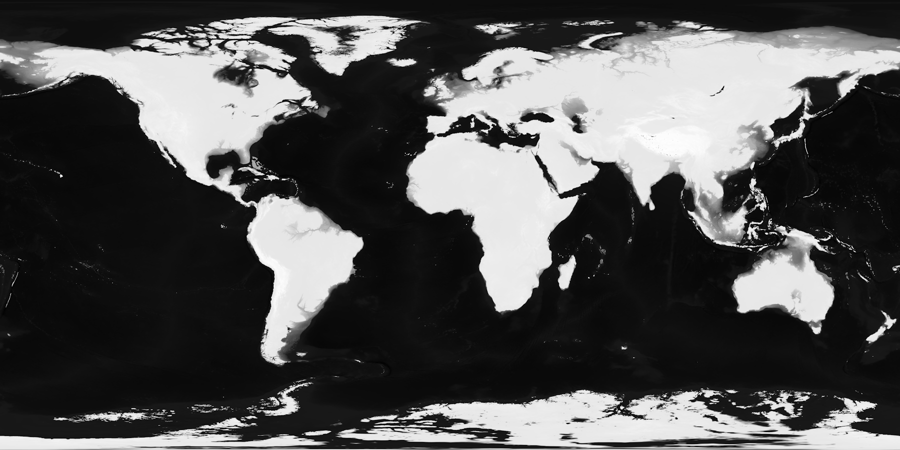

We can render this using a custom shader and a sphere in THREE.js. We load the
heightTexture and sample the color using the texture coordinate. Then we convert
this grayscale value back to the height and then darken the output color
accordingly.

```glsl
vec4 heightColor = texture2D(heightTexture, vUv);
float heightIntensity = heightColor.r * 255.0;

float height = 0.0;

if (heightIntensity < 25.0) {
  height = -150.0 + (25.0 - heightIntensity) / 25.0 * -8714.0;
} else if (heightIntensity <= 230.0) {
  height = heightIntensity - 175.0;
} else {
  height = (heightIntensity - 230.0) / 25.0 * 5724.0;
}

if (height < sealevel) {
  float darkness = 1.0 - (height / -8714.0 * 0.25);
  outColor = waterColor * darkness;
} else {
  float darkness = 1.0 - (height / 5724.0 * 0.25);
  outColor = grassColor * darkness;
}
```

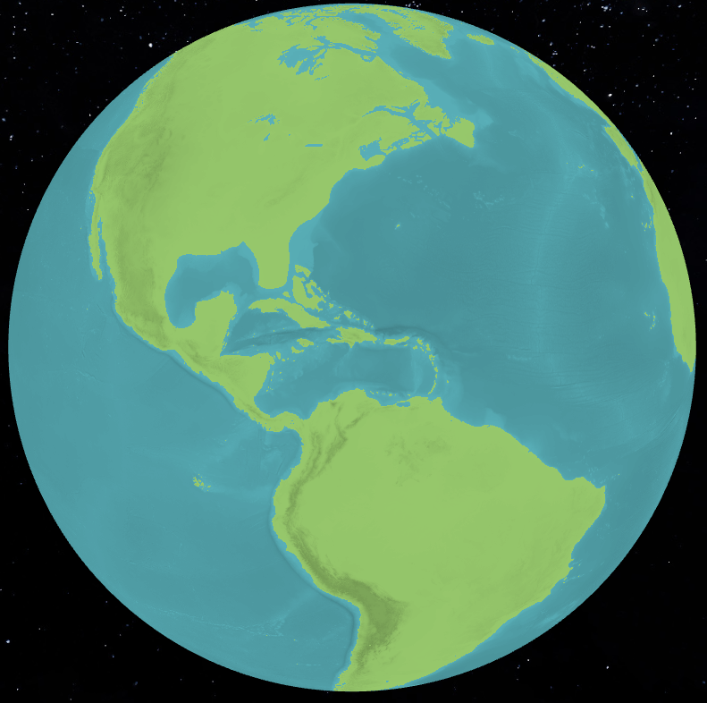

## Historic sea levels

To make this interactive we will need data about historic sea levels. I
downloaded the
[Global Sea Level Reconstruction dataset](https://www1.ncdc.noaa.gov/pub/data/paleo/contributions_by_author/spratt2016/spratt2016.txt)
from the NOAA Paleoclimatology Program. This contains global sea levels up to
800,000 years ago. I extracted only the sea level values and stored these in a
binary file.

If we now switch between 15,000 years ago and the present, you can see that the
area between Great Brittain and mainland Europe was previously connected (see
image below). This area is called Doggerland and fisherman still dredge up bone
tools, mammoth tusks from there. Another interesting area is the Bering Strait.
This gap between Russia and Alaska used to land, and facilitated the movement of
early humans from Asia to the Americas.

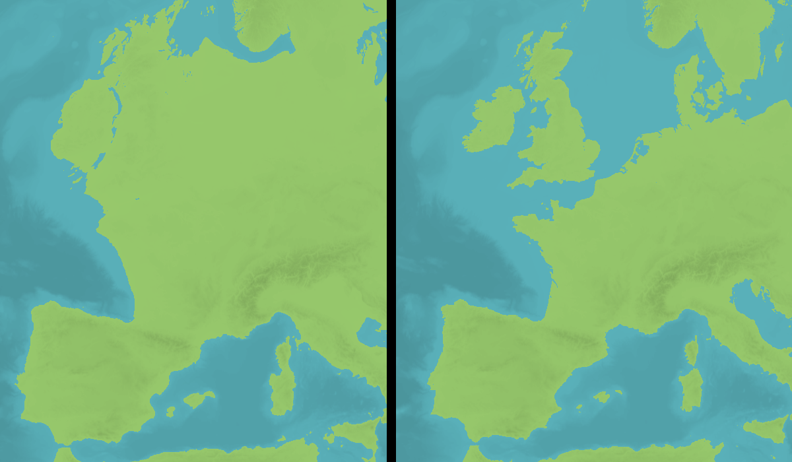

## Climate data

Now we have an interactive map, but everything is still either green or blue. To
add some more color we need information about the climate, like rainfall and
temperature. Lucky for us there is
[a dataset](https://www.ncei.noaa.gov/access/paleo-search/study/38661) that
contains simulated climate data up to 3 million years ago. You can see an
example of daily average rainfall below:

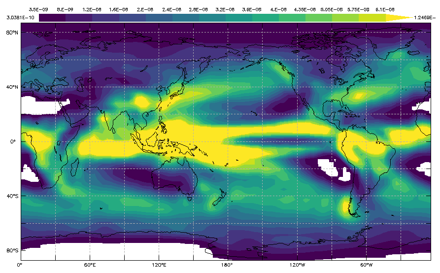

I load the data into the GPU using a sampler2DArray. This is basically a stack
of textures, where each layer in the stack is a certain time period. Each pixel
in a texture contains r, g and b values, which encode for minimum and maximum
temperature and rainfall. By sampling this texture, you sample both over time
and over location. So if the current view year is between two layers, it will
average the values.

I then wrote some code to choose the render color, based on these values. And a
function to slide between different colors so there are no hard edges. For
example when the temperature is high and the rainfall is low, it is desert. But
if the rainfall is high, it shows as forest. With some tweeking this turned out
to work really well for my purposes.

```glsl
vec3 slideColor(vec3 from, vec3 to, float value, float low, float high) {
  float ratio = (value - low) / (high - low);
  return mix(from, to, ratio);
}

vec3 color = slideColor(
  slideColor(
    snowColor, 
    slideColor(desertColor, grassColor, precipitation, 250.0, 500.0), 
    maxTemp, 5.0, 10.0
  ),
  slideColor(
    slideColor(desertColor, grassColor, precipitation, 400.0, 1000.0),
    slideColor(grassColor, forestColor, precipitation, 1000.0, 2000.0),
    precipitation, 200.0, 1000.0
  ),
  maxTemp, 0.0, 10.0
);
```

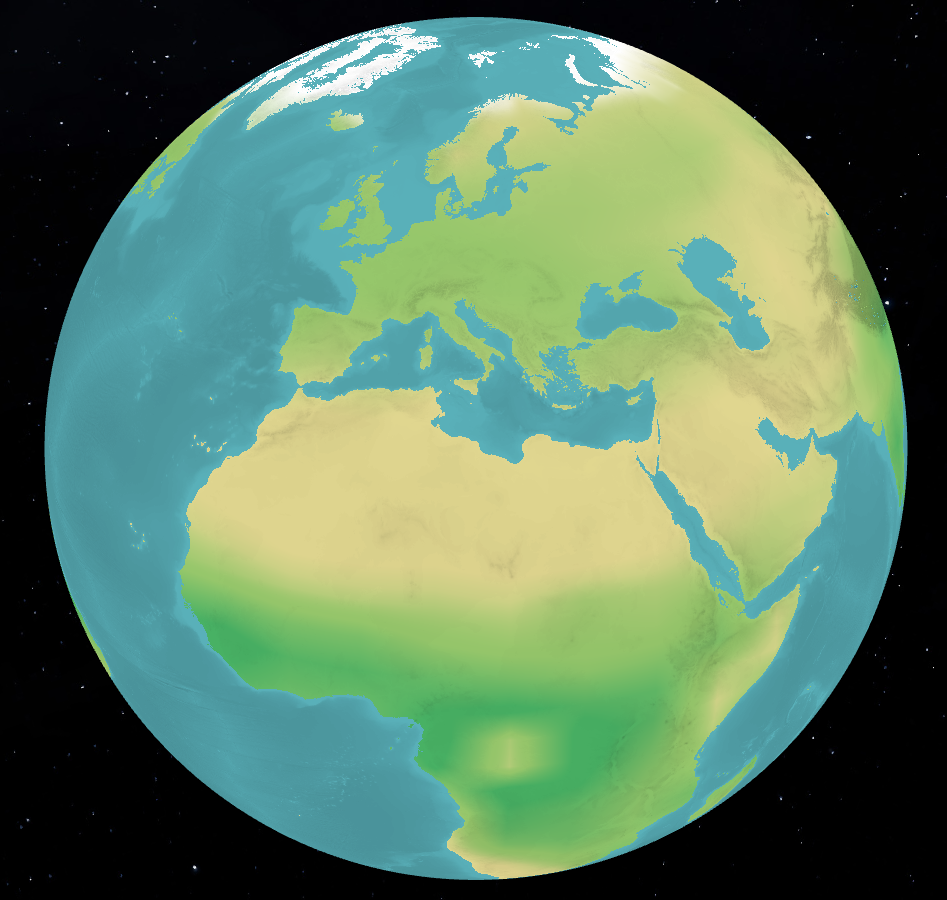

## Ice sheets

The last ice age ended about 12,000 years ago and had a big impact on early
human settlement. We will need accurate data about the historical locations of
ice sheets that were formed to visualise this on our globe. I ended up using the
[Global ice sheet reconstruction for the past 80000 years dataset](https://doi.pangaea.de/10.1594/PANGAEA.905800).
This is the most accurate and highest resolution dataset I could find, with a
0.25 degree grid and 2500 year time steps.

This dataset is in NetCDF format which I parsed using the netcdf4 library. It
contains ice thickness data, but for my purposes it is enough to know if there
is an ice sheet or not. The output of this looks like the image below:

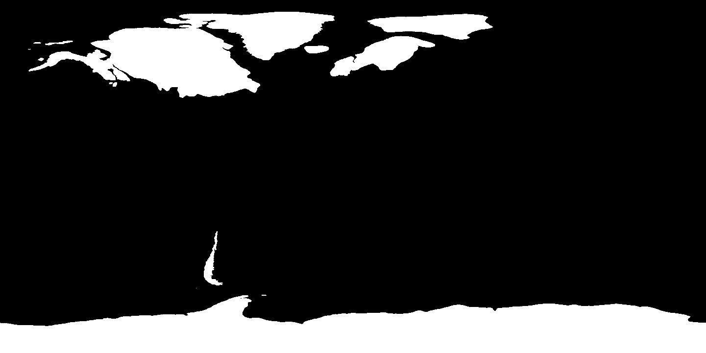

To render this efficiently with a GPU, we need to somehow transform this into
triangles. Because even a very large texture would look ugly when zoomed in. I
did this in multiple steps. First I find all individual "islands" of ice using a
flood fill algorithm. Then I find the edges of each island and turn that into
lists of coordinates. Then I run a smoothing step to smooth out the edges and
optimize the amount of points needed.

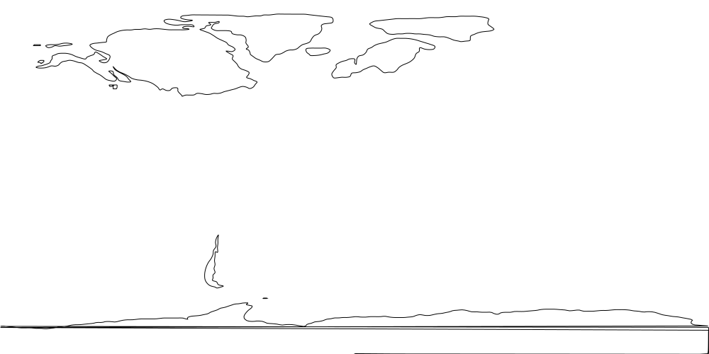

I then add points in regular intervals over the surface of the shape (red
points). After that I use
[Delaunay triangulation](https://github.com/mapbox/delaunator) to turn this into
triangles by creating edges between the points in a smart way. You can see the
result of this below:

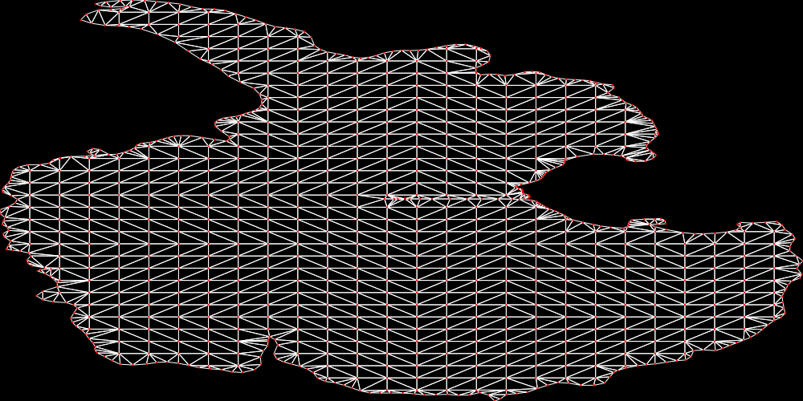

Then we can project these flat points onto our globe and render these shapes
using THREE.js. The added points in the center are essential to ensure a smooth
curvature. The shader also darkens higher elevations to give some texture to the
ice sheets.

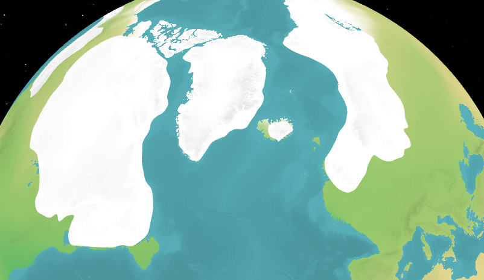

## Borders

Lastly I wanted to add modern country borders to make it easier to understand
the exact locations of certain features. I used the
[World Administrative Boundaries - Countries and Territories](https://public.opendatasoft.com/explore/dataset/world-administrative-boundaries/export/)
for this. This dataset stores the coordinates of all borders between different
countries.

I used the same smoothing algorithm from before to smooth the jagged edges and
reduce the number of points. This was then rendered on top of the globe using
THREE.js lines.

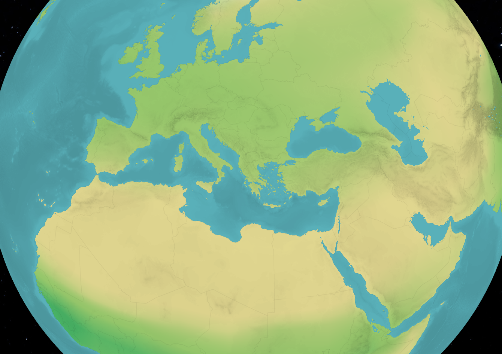

## Demo

You can check out the live demo [here](https://technistuff.com/human-history)

My next steps are to look at finding more accurate data, or datasets that go
even further back in time. I would also like to display historical events like
human migration, first civilisations and wars onto the map. I already made a
start on this, but it needs more work.

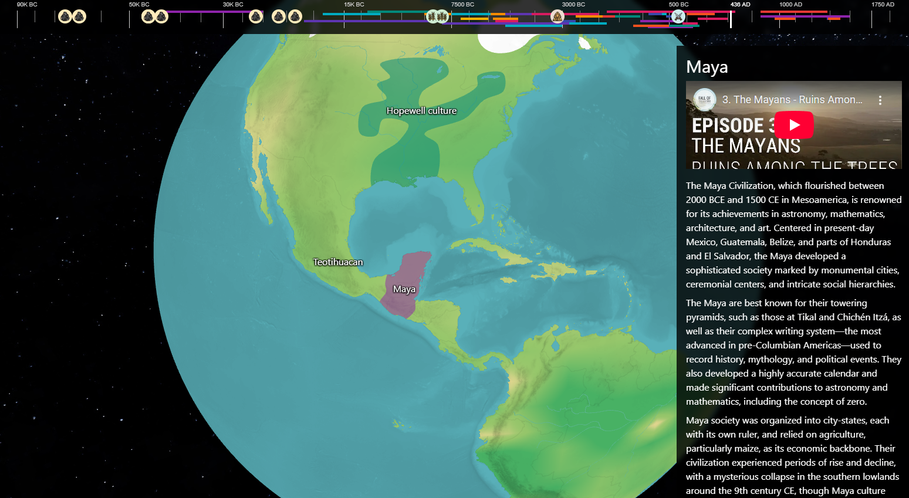

youtube video https://www.youtube.com/watch?v=srO5sq4_Mxw
